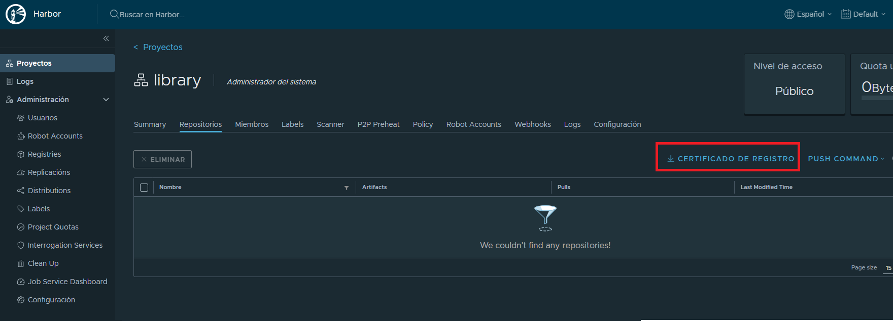

# **Ejercicio 07: Conexión a un Registry Privado y Gestión de Charts en Helm**

>Harbor es una plataforma de registro de contenedores de código abierto que se utiliza para almacenar, firmar y escanear imágenes de contenedores, proporcionando mayor seguridad y eficiencia en la gestión de imágenes dentro de entornos de Kubernetes. Al centralizar el almacenamiento de imágenes en un registro privado, Harbor permite a las organizaciones aplicar políticas de seguridad, autenticación y control de acceso, lo que resulta esencial en despliegues empresariales donde la protección de datos es crucial. Además, su integración con herramientas como Helm facilita la gestión de charts, optimizando así el ciclo de vida de las aplicaciones en Kubernetes.

### **Objetivo**

Este ejercicio tiene como objetivo que te familiarices con la conexión a un registry privado de Harbor, realizando operaciones comunes como el push, pull e instalación de un chart desde este registry en un entorno local de Kubernetes.

---

### **Enunciado**

Debes realizar una conexión y autenticación en un registry privado de Harbor (IP pública), y llevar a cabo operaciones de push, pull e instalación de un chart. Esto te permitirá aprender cómo gestionar charts en un entorno seguro y privado.

---

### **Requisitos del ejercicio:**

- Máquina virtual con Linux que tenga instalados `kubectl` y `helm`.
- Haber completado al menos el **Ejercicio04**, ya que reutilizarás el chart generado en ese ejercicio o alguno posterior.

---

### **Paso a paso**

#### 1. Descarga del certificado raíz de Harbor

>El certificado raíz es un componente esencial para la autenticación segura en conexiones HTTPS. Al instalarlo en el sistema local, garantizas que el cliente confíe en el certificado del servidor del registry. Sin esta configuración, el sistema considera que el certificado del registry proviene de una autoridad desconocida, lo que da lugar a errores como "certificado firmado por una autoridad desconocida" y evita la conexión segura.
>
>Este proceso de confianza también asegura que la comunicación con el registry sea encriptada y protegida, previniendo la interceptación de datos sensibles como credenciales o configuraciones.

   - Accede al registry privado en el navegador, usando su IP pública.
   - Inicia sesión en Harbor.


   - Ve a la sección de **Proyectos** y selecciona tu proyecto.


   - Descarga el certificado raíz desde la interfaz de Harbor.



#### 2. Activación del certificado raíz en la máquina virtual
   - Copia el certificado descargado (`ca.crt`) a la carpeta `/usr/local/share/ca-certificates/` usando el siguiente comando:
     ```bash
     sudo cp ~/Downloads/ca.crt /usr/local/share/ca-certificates/
     ```
   - Activa el certificado con el siguiente comando:
     ```bash
     sudo update-ca-certificates
     ```

#### 3. Configuración de /etc/hosts para simular un dominio

>El DNS es crucial para mapear la IP del registry a un nombre de dominio, como core.harbor.domain. Muchas aplicaciones, incluyendo helm y docker, requieren un dominio para gestionar certificados correctamente, ya que las conexiones HTTPS suelen fallar si se usan IPs directas debido a políticas de seguridad. Al agregar la IP y el nombre de dominio en /etc/hosts, simulas un DNS local que permite a tu sistema resolver core.harbor.domain correctamente.
>
>Sin esta configuración DNS, el sistema no podría localizar el registry usando el dominio, lo que afectaría comandos como helm push o docker login. Además, facilita la escalabilidad y reutilización de scripts y configuraciones, ya que podrías cambiar la IP del registry en el futuro sin necesidad de modificar múltiples configuraciones

   - Agrega la siguiente línea en el archivo `/etc/hosts`:
     ```plaintext
     <IP_publica>  core.harbor.domain
     ```

#### 4. Empaquetado del chart del ejercicio anterior
   - Ubícate en el mismo directorio donde tienes el chart del ejercicio04 (o posterior) y empaquétalo usando:
     ```bash
     helm package nombre-chart
     ```

#### 5. Inicio de sesión en Harbor desde la consola
   - Inicia sesión en el registry de Harbor con el siguiente comando:
     ```bash
     helm registry login -u <usuario> core.harbor.domain
     ```

#### 6. Subida del chart empaquetado a Harbor
   - Sube el chart al registry:
     ```bash
     helm push nombre-chart-0.1.0.tgz oci://core.harbor.domain/<proyecto>
     ```
   - Entra nuevamente al registry Harbor (ahora puedes hacerlo desde la URL `core.harbor.domain`) y verifica que se ha subido el chart dentro de tu proyecto.

#### 7. Descarga e instalación del chart desde el registry
   - Instala el chart descargado en tu cluster local:
     ```bash
     helm install chartpropio oci://core.harbor.domain/<proyecto>/nombre-chart
     ```

---

### **Entregables**

- Capturas de pantalla de todos los resultados obtenidos durante el despliegue (incluyendo pods, servicios y acceso a la aplicación).
- Un archivo de texto con los comandos ejecutados y cualquier salida relevante de los mismos.
- El chart de Helm empaquetado (`nombre-chart-0.1.0.tgz`). 

---

Asegúrate de seguir cada paso con precisión y revisa cada salida para verificar que no haya errores.

