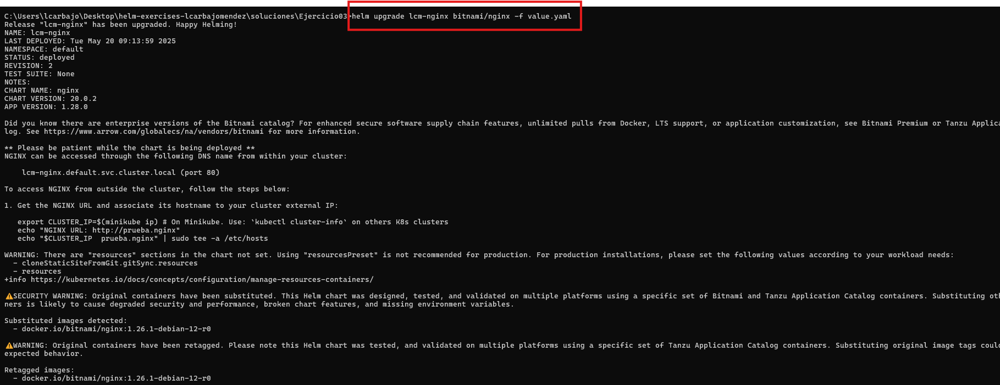
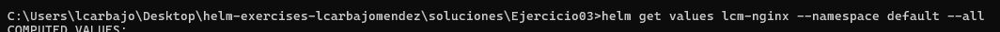
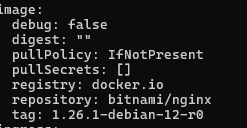
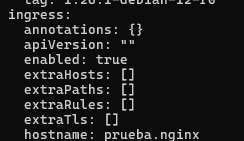
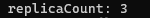
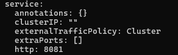
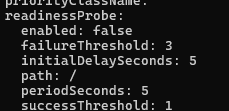
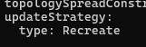

## Solución del Ejercicio 3: Desplegando Nginx en Kubernetes con Helm

## Enunciado

En este ejercicio, deberás desplegar el chart `bitnami/nginx`, configurando todos los elementos necesarios a través de un archivo `values.yaml`.

### Requisitos del despliegue:

1. **Descargar e instalar** el chart `bitnami/nginx` utilizando el comando que aparece en la documentación (en `artifacthub.io`).

2. **Crear un archivo `values.yaml`**: Debe incluir todas las configuraciones necesarias para el despliegue, tales como:
   - Usar la imagen por defecto, pero en su versión `1.26.1-debian-12-r0`.
   - Desplegar 3 réplicas.
   - La estrategia de actualización debe ser `Recreate`.
   - Desactivar `livenessProbe` y `readinessProbe`.
   - Cambiar el puerto HTTP del servicio al `8081`.
   - Habilitar la creación de un ingress, con el host en `prueba.nginx`.

3. **Actualizar** el chart desplegado, utilizando el fichero `value.yaml`.

4. **Verificar** que lo requerido en el value, fue desplegado con éxito.


## Resolución

Comenzando con el primer paso, descargamos el chart `bitnami/nginx` a través de este conjunto de comandos:

```bash
helm repo add bitnami https://charts.bitnami.com/bitnami
helm install lcm-nginx bitnami/nginx
```


Para verificar que se ha creado correctamente el release `lcm-nginx`, usamos el comando `helm list`


Con este conjunto de comandos se descarga el chart `nginx` desde el repositorio `bitnami` y se instala con el nombre de release `lcm-nginx`.

Luego, creamos un archivo `values.yaml` con las configuraciones necesarias para el despliegue:

```yaml
# Especifica la imagen de Docker que se usará, con su etiqueta correspondiente
image:
  tag: 1.26.1-debian-12-r0
# Define la cantidad de réplicas del despliegue
replicaCount: 3
# Estrategia de actualización para el despliegue
updateStrategy:
  # Tipo de estrategia de actualización: Recreate implica que las réplicas actuales se eliminan antes de crear nuevas
  type: Recreate
  # Configuración para rolling updates (nulo en este caso, ya que se usa Recreate)
  rollingUpdate: null
# Configuración para la sonda de vida (liveness probe) que verifica si el contenedor está funcionando
livenessProbe:
  # Indica que la sonda está deshabilitada
  enabled: false
# Configuración para la sonda de disponibilidad (readiness probe) que verifica si el contenedor está listo para recibir tráfico
readinessProbe:
  # Indica que la sonda está deshabilitada
  enabled: false
# Configuración del servicio para exponer el contenedor
service:
  # Define el puerto HTTP en el que se expondrá el servicio
  http: 8081
# Configuración del ingreso (ingress) para el tráfico HTTP externo
ingress:
  # Indica que el ingreso está habilitado
  enabled: true
  # Define el hostname que se usará para acceder al ingreso
  hostname: prueba.nginx
```
Este archivo `values.yaml` contiene las configuraciones necesarias para el despliegue con las características especificadas em el segundo punto. 

Luego, actualizamos el chart desplegado, utilizando el fichero `value.yaml` usando:

```bash
helm upgrade <nombre-del-release> <repositorio/nombre-del-chart> -f values.yaml
```
Este comando actualiza el release existente con las configuraciones definidas en el archivo `values.yaml`.

```bash
helm upgrade lcm-nginx bitnami/nginx -f value.yaml
```
Ejemplo concreto del comando anterior, actualizando el release `lcm-nginx` con el chart `bitnami/nginx` y aplicando las configuraciones del archivo `value.yaml`.



Por último, verificamos que lo requerido en el value, fue desplegado con éxito utilzando este conjunto de comandos:

```bash
helm get values lcm-nginx --namespace default --all
```
Obtiene todos los valores del release `lcm-nginx` en el namespace `default`.

Si queremos concretamente solo los valores actuales del release `lcm-nginx`:

```bash
helm get values lcm-nginx
```
En mi caso he usado el primero, teniendo que buscar los puntos relevantes del código respecto al archivo `values.yaml` para verificar que se ha desplegado correctamente.



Image: 1.26.1-debian-12-r0



Ingress: Enabled



Replicas: 3



Service: 8081



Liveness: Disabled


Readiness: Disabled



Strategy: Recreate



