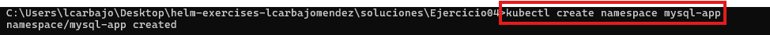
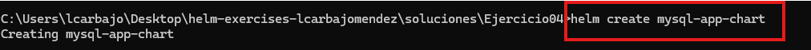

## Solución de Ejercicio 04: Crear y Empaquetar Aplicaciones Complejas en Kubernetes Usando Helm

### **Enunciado**

En este ejercicio, deberás **crear manualmente** los manifiestos de Kubernetes necesarios para una aplicación compuesta por **MySQL** y **phpMyAdmin**. Posteriormente, empaquetarás estos manifiestos en un **chart de Helm propio** y desplegarás la aplicación en un clúster de Kubernetes utilizando este chart.

---

### **Requisitos del Despliegue:**

1. **Namespace:**
   - Todos los componentes deben ser desplegados en un namespace llamado `mysql-app`.
    kubectl create namespace mysql-app

2. **Recursos de Kubernetes:**
   - Deberás crear los manifiestos de los siguientes recursos:
     - **MySQL**:
       - Utiliza la imagen oficial de MySQL, asegurándote de usar la versión adecuada.
       - No debe ser un deployment (¿Qué objeto sería el adecuado?)
       - Implementa un **volumen persistente** para la base de datos.
       - Configura los secretos necesarios (como las credenciales de acceso a la base de datos) usando un **Secret**.
     - **phpMyAdmin**:
       - Utiliza la imagen oficial de `phpmyadmin`.
       - Crea un **Deployment** para phpMyAdmin.
   - **Service**:
     - Crea los **Services** necesarios para exponer MySQL y phpMyAdmin.
     - Para MySQL, utiliza el puerto adecuado para la base de datos (3306).
     - Para phpMyAdmin, expón el servicio en un puerto configurable.
   - **ConfigMaps y Secretos**:
     - Crea los **ConfigMaps** y **Secretos** necesarios para la configuración de la aplicación (por ejemplo, las credenciales de MySQL).

3. **Empaquetar los Manifiestos en un Chart de Helm**:
   - Crea un **chart de Helm** desde cero, empaquetando todos los manifiestos que creaste.
   - Utiliza el comando `helm create <nombre-chart>` para generar la estructura básica de un chart.
   - Coloca tus manifiestos de Kubernetes en la carpeta correspondiente dentro del chart (`templates/`).
   - Asegúrate de que el chart esté correctamente estructurado y empaquetado.

4. **Archivo values.yaml**:
   - Crea un archivo `values.yaml` que incluya las configuraciones necesarias para los elementos a desplegar:
     - **Versiones de las imágenes** de MySQL y phpMyAdmin.
     - **Configuraciones de la Base de Datos** (credenciales, nombre de la base de datos, etc.).
     - **Capacidad de los volúmenes persistentes**.
     - **Configuraciones de phpMyAdmin**.
     - Las opciones que no deben ser modificadas no deben estar incluidas en el `values.yaml`.

---

### **Pasos del Despliegue:**

1. **Iniciar el Entorno:**
   - Asegúrate de que tu clúster de Kubernetes esté corriendo (puedes usar **Minikube** o cualquier otro clúster compatible con Kubernetes):
     ```bash
     minikube start
     ```

2. **Crear los Manifiestos:**
   - Crea los manifiestos de Kubernetes (Deployment, StatefulSet, Service, Secret, ConfigMap, etc.) para MySQL y phpMyAdmin. Los archivos deben estar en formato `.yaml`.

3. **Empaquetar los Manifiestos en un Chart de Helm:**
   - Usa el siguiente comando para crear la estructura básica de un chart de Helm:
     ```bash
     helm create mysql-app-chart
     ```
   - Coloca todos los manifiestos en la carpeta `templates/` del chart.
   - Modifica el archivo `Chart.yaml` para reflejar correctamente el nombre de tu chart y las versiones de los componentes.

4. **Crear el Archivo values.yaml:**
   - Configura el archivo `values.yaml` para gestionar las versiones de las imágenes, las credenciales, el tamaño de los volúmenes, y otras configuraciones necesarias.

5. **Instalar el Chart de Helm:**
   - Una vez que hayas empaquetado los manifiestos en el chart de Helm, instálalo en tu clúster utilizando:
     ```bash
     helm install <nombre-release> ./mysql-app-chart --namespace mysql-app --create-namespace
     ```
     me ha dado un error por tener un secreto ya creado al probar con Kubernetes antes.

6. **Verificar el Despliegue:**
   - Comprueba que los pods y servicios están corriendo correctamente en el namespace `mysql-app`:
     ```bash
     kubectl get pods -n mysql-app
     kubectl get svc -n mysql-app
     ```

7. **Acceso a la Aplicación:**
   - Para acceder a phpMyAdmin, verifica los servicios expuestos:
     ```bash
     kubectl get svc -n mysql-app
     ```
   - Si estás usando **Minikube**, puedes acceder a los servicios utilizando:
     ```bash
     minikube service <nombre-release>-phpmyadmin -n mysql-app
     ```

---

## Resolución

Respecto a los requisitos del despliegue de la aplicación, se deben seguir los siguientes pasos:

1.- **Namespace:**

Para crear un namespace, ejecutamos `kubectl create namespace mysql-app`. Con esto, creamos un namespace llamado mysql-app.



2.- **Recursos de Kubernetes:**

En mi caso, he seguido los requisitos solicitados y antes de relacionarlo con el chart de Helm, he creado los siguientes recursos de Kubernetes:

````bash
kubectl apply -f secret.yaml
kubectl apply -f configmap.yaml
kubectl apply -f pv.yaml
kubectl apply -f pvc.yaml
kubectl apply -f mysql-statefulset.yaml
kubectl apply -f phpmyadmin-deployment.yaml
kubectl apply -f mysql-service.yaml
kubectl apply -f phpmyadmin-service.yaml
minikube service phpmyadmin -n mysql-app
````
Con estos recursos ya probados su funcionamiento he realizado el despliegue de la aplicación en Helm (los archivos se desarrollarán en puntos posteriores). Como he comentado, primero quería corroborar que funcionarán correctamente los recursos de Kubernetes y posteriormente los empaquetar en un chart de Helm. A lo largo del desarrollo de estos archivos, los mayores errores encontrados ha sido la denegación  de acceso a la base de datos con los usuarios que se han creado en el archivo `secret.yaml`. Por ende, se fue modificando el conjunto de archivos para que funcionarán al unisono.


3.- **Empaquetar los Manifiestos en un Chart de Helm:**

Una vez ya probados los recursos de Kubernetes, se procede a empaquetarlos en un chart de Helm. Para ello, se utiliza el siguiente comando:

```bash
 helm create mysql-app-chart
```
Este comando nos creará la estructura básica de un chart de Helm. A continuación, se deben agregar los manifiestos realizados anteriormente en la carpeta `templates` del chart de Helm sustituyendo los ya existentes.



4.- **Archivo values.yaml:**

En este punto vamos a desarrollar todos los archivos que se encuentran en la carpeta `templates` del chart de Helm, además del propio archivo `values.yaml` que se encuentra en la raíz del chart de Helm el cual modifica todos estos. Para la realización de este archivo, seguiremos las directrices descritas.

````yaml
mysql:
  image: mysql:latest           # Imagen de MySQL que se utilizará
  user: "user"                  # Nombre de usuario estándar de MySQL
  userPassword: "userpassword"  # Contraseña del usuario estándar
  rootPassword: "rootpassword"  # Contraseña del usuario root
  databaseName: "mydatabase"    # Nombre de la base de datos a crear
  storage:
    size: 5Gi                   # Tamaño del almacenamiento para MySQL
  resources:
    requests:
      memory: "512Mi"           # Memoria mínima requerida
      cpu: "1"                  # CPU mínima requerida
    limits:
      memory: "4Gi"             # Memoria máxima permitida
      cpu: "2"                  # CPU máxima permitida

phpMyAdmin:
  image: phpmyadmin/phpmyadmin  # Imagen de phpMyAdmin
  port: 80                      # Puerto en el que phpMyAdmin estará disponible

service:
  phpMyAdminNodePort: 31008     # Puerto NodePort para acceder a phpMyAdmin externamente

persistentVolume:
  storageClassName: standard    # Nombre de la StorageClass utilizada para el PersistentVolume
  size: 1Gi                     # Tamaño del almacenamiento del PersistentVolume
````
En este archivo se encuentran los parámetros que se utilizan en la configuración de MySQL y phpMyAdmin. Tambien se encuentra el puerto NodePort para acceder a phpMyAdmin externamente. Por último, se encuentra el tamaño del almacenamiento del PersistentVolume.

`**Configmap.yaml**:

````yaml
# Especifica la versión de la API de Kubernetes para el recurso ConfigMap
apiVersion: v1
# Define el tipo de recurso, en este caso, un ConfigMap
kind: ConfigMap
# Metadatos asociados al ConfigMap
metadata:
  # Nombre del ConfigMap
  name: mysql-config
  # Espacio de nombres en el que se crea el ConfigMap, usando un valor dinámico del release
  namespace: {{ .Release.Namespace }}
# Datos del ConfigMap
data:
  # Variable de entorno para el nombre de la base de datos MySQL, usando un valor dinámico de Helm
  MYSQL_DATABASE: {{ .Values.mysql.databaseName }}
````
El configmap se utiliza para pasar la variable de entorno MYSQL_DATABASE a la base de datos MySQL, de esta manera se puede crear la base de datos con el nombre deseado.

**Secret.yaml:**

````yaml
# Especifica la versión de la API de Kubernetes para el recurso Secret
apiVersion: v1
# Define el tipo de recurso, en este caso, un Secret
kind: Secret
# Metadatos asociados al Secret
metadata:
  # Nombre del Secret
  name: mysql-secret
  # Espacio de nombres donde se desplegará el Secret, dinámico con Helm
  namespace: {{ .Release.Namespace }}
# Tipo de Secret: Opaque es el tipo predeterminado para almacenar datos arbitrarios como pares clave-valor
type: Opaque
# Datos almacenados en el Secret
data:
  # Contraseña del usuario root de MySQL, codificada en Base64
  mysql-root-password: {{ .Values.mysql.rootPassword | b64enc | quote }}
  # Contraseña del usuario estándar de MySQL, codificada en Base64
  mysql-user-password: {{ .Values.mysql.userPassword | b64enc | quote }}
````
El secret se utiliza para almacenar las contraseñas de los usuarios de la base de datos MySQL, de esta manera se pueden configurar las contraseñas de los usuarios root y estándar de MySQL. Las contraseñas se codifican en Base64 para que no se vean en texto plano. 

**Mysql-statefulset.yaml:**

````yaml
# Especifica la versión de la API de Kubernetes para el recurso StatefulSet
apiVersion: apps/v1
# Define el tipo de recurso, en este caso, un StatefulSet
kind: StatefulSet
# Metadatos asociados al StatefulSet
metadata:
  # Nombre del StatefulSet
  name: mysql
  # Espacio de nombres en el que se despliega el StatefulSet, dinámico con Helm
  namespace: {{ .Release.Namespace }}
  # Etiquetas adicionales para clasificar y seleccionar el recurso
  labels:
    app: mysql        # Identifica la aplicación como MySQL
    type: standalone   # Define el tipo de despliegue como standalone
# Especificación del StatefulSet
spec:
  # Número de réplicas que tendrá el StatefulSet
  replicas: 1
  # Selector que relaciona este StatefulSet con los Pods adecuados
  selector:
    matchLabels:
      app: mysql        # Busca Pods con esta etiqueta
      type: standalone  # Asegura coincidencia con el tipo "standalone"
  # Nombre del Service que gestiona las réplicas del StatefulSet
  serviceName: mysql
  # Plantilla de Pod asociada al StatefulSet
  template:
    metadata:
      # Etiquetas del Pod
      labels:
        app: mysql
        type: standalone
    spec:
      # Contenedores dentro del Pod
      containers:
      - name: mysql             # Nombre del contenedor
        image: {{ .Values.mysql.image }}  # Imagen de Docker para el contenedor
        imagePullPolicy: IfNotPresent     # Política de obtención de la imagen
        ports:
        - name: server          # Nombre descriptivo del puerto
          containerPort: 3306   # Puerto expuesto por el contenedor
        env:
        # Variables de entorno necesarias para configurar MySQL
        - name: MYSQL_ROOT_PASSWORD
          valueFrom:
            secretKeyRef:
              name: mysql-secret       # Nombre del Secret que contiene la contraseña
              key: mysql-root-password # Clave dentro del Secret
        - name: MYSQL_DATABASE
          value: {{ .Values.mysql.databaseName }}  # Nombre de la base de datos
        - name: MYSQL_USER
          value: {{ .Values.mysql.user }}          # Usuario de la base de datos
        - name: MYSQL_PASSWORD
          valueFrom:
            secretKeyRef:
              name: mysql-secret        # Secret que contiene la contraseña
              key: mysql-user-password  # Clave dentro del Secret
        # Montaje de volúmenes para datos persistentes
        volumeMounts:
        - name: data
          mountPath: /var/lib/mysql   # Ruta donde se montará el volumen
        # Configuración de recursos para el contenedor
        resources:
          limits:
            memory: {{ .Values.mysql.resources.limits.memory }} # Límite de memoria
            cpu: {{ .Values.mysql.resources.limits.cpu }}       # Límite de CPU
          requests:
            memory: {{ .Values.mysql.resources.requests.memory }} # Solicitud de memoria
            cpu: {{ .Values.mysql.resources.requests.cpu }}       # Solicitud de CPU
  # Plantilla para reclamar volúmenes persistentes
  volumeClaimTemplates:
  - metadata:
      name: data
      labels:
        app: mysql        # Etiquetas asociadas al volumen
        type: standalone  # Indica que es un volumen standalone
    spec:
      # Modos de acceso al volumen
      accessModes:
      - ReadWriteOnce     # El volumen solo puede ser montado por un nodo a la vez
      # Clase de almacenamiento para el volumen
      storageClassName: {{ .Values.persistentVolume.storageClassName }}
      resources:
        requests:
          storage: {{ .Values.mysql.storage.size }} # Espacio solicitado para el volumen
````
En este archivo, se definen las configuraciones para el contenedor de MySQL. Se establecen las políticas de obtención de imágenes, se especifican los puertos expuestos, se definen las variables de entorno, se montan los volúmenes persistentes, se definen los recursos para el contenedor y se define la plantilla para reclamar volúmenes persistentes. La configuración de los recursos y el almacenamiento se puede personalizar mediante valores de la plantilla `values.yaml`. 

**Mysql-service.yaml:**

````yaml
# Especifica la versión de la API de Kubernetes para el recurso Service
apiVersion: v1
# Define el tipo de recurso, en este caso, un Service
kind: Service
# Metadatos asociados al Service
metadata:
  # Nombre del Service
  name: mysql
  # Espacio de nombres donde se creará el Service, dinámico gracias a Helm
  namespace: {{ .Release.Namespace }}
  # Etiquetas adicionales para categorizar y seleccionar el recurso
  labels:
    app: mysql        # Etiqueta para identificar la aplicación
    type: standalone   # Etiqueta que define el tipo de despliegue de la aplicación
# Especificación del Service
spec:
  # Tipo de Service, en este caso ClusterIP, para comunicación interna dentro del clúster
  type: ClusterIP
  # Definición de los puertos que expondrá el Service
  ports:
  - name: server         # Nombre descriptivo del puerto
    port: 3306           # Puerto que el Service expondrá
    protocol: TCP        # Protocolo usado, en este caso TCP
    targetPort: 3306     # Puerto dentro del contenedor que maneja el tráfico
  # Selector que vincula este Service con los Pods adecuados
  selector:
    app: mysql           # Busca Pods con la etiqueta "app: mysql"
    type: standalone     # Asegura que solo coincida con los Pods del tipo standalone
````
En este archivo, se define un recurso Service para el contenedor de MySQL. Se especifica la versión de la API de Kubernetes, el tipo de recurso, los metadatos y la especificación del Service. La configuración de los puertos y el selector se pueden personalizar mediante valores de la plantilla `values.yaml`.

**Phpmyadmin-deployment.yaml:**

````yaml
# Especifica la versión de la API de Kubernetes para el recurso Deployment
apiVersion: apps/v1
# Define el tipo de recurso, en este caso, un Deployment
kind: Deployment
# Metadatos asociados al Deployment
metadata:
  # Nombre del Deployment
  name: phpmyadmin
  # Espacio de nombres en el que se desplegará el Deployment, dinámico con Helm
  namespace: {{ .Release.Namespace }}
# Especificación del Deployment
spec:
  # Número de réplicas para el Deployment
  replicas: 1
  # Selector que relaciona este Deployment con los Pods adecuados
  selector:
    matchLabels:
      app: phpmyadmin  # Busca Pods con esta etiqueta
  # Plantilla del Pod asociada al Deployment
  template:
    metadata:
      # Etiquetas del Pod
      labels:
        app: phpmyadmin
    spec:
      # Contenedores dentro del Pod
      containers:
      - name: phpmyadmin           # Nombre del contenedor
        image: {{ .Values.phpMyAdmin.image }}  # Imagen de Docker para phpMyAdmin, definida en los valores de Helm
        ports:
        - containerPort: {{ .Values.phpMyAdmin.port }}  # Puerto que expone el contenedor, dinámico desde los valores
        # Variables de entorno necesarias para la configuración de phpMyAdmin
        env:
        - name: PMA_HOST
          value: mysql          # Host de la base de datos, en este caso el nombre del servicio de MySQL
        - name: PMA_PORT
          value: "3306"         # Puerto en el que MySQL está esc
````
En este archivo, se define un recurso Deployment para el contenedor de phpMyAdmin. Se especifica la versión de la API de Kubernetes, el tipo de recurso, los metadatos y la especificación del Deployment. Además, se define la plantilla del Pod asociada al Deployment, incluyendo el selector, los contenedores, las variables de entorno y los puertos. La configuración de la imagen y el puerto se pueden personalizar mediante valores de la plantilla `values.yaml`.

**Phpmyadmin-service.yaml:**

````yaml
# Especifica la versión de la API de Kubernetes para el recurso Service
apiVersion: v1
# Define el tipo de recurso, en este caso, un Service
kind: Service
# Metadatos asociados al Service
metadata:
  # Nombre del Service
  name: phpmyadmin-service
  # Espacio de nombres donde se desplegará el Service, dinámico con Helm
  namespace: {{ .Release.Namespace }}
# Especificación del Service
spec:
  # Tipo de Service: NodePort expone el servicio a través de un puerto específico en cada nodo del clúster
  type: NodePort
  # Selector que relaciona este Service con los Pods adecuados
  selector:
    app: phpmyadmin  # Busca Pods con esta etiqueta
  # Configuración de los puertos del Service
  ports:
  - protocol: TCP                            # Protocolo utilizado, en este caso TCP
    nodePort: {{ .Values.service.phpMyAdminNodePort }} # Puerto expuesto en los nodos del clúster
    port: {{ .Values.phpMyAdmin.port }}              # Puerto expuesto por el Service dentro del clúster
    targetPort: {{ .Values.phpMyAdmin.port }}        # Puerto al que redirige el tráfico dentro del contenedor
````
En este archivo, se define un recurso Service para el contenedor de phpMyAdmin. Se especifica la versión de la API de Kubernetes, el tipo de recurso, los metadatos y la especificación del Service. La configuración de los puertos se pueden personalizar mediante valores de la plantilla `values.yaml`.

Una vez ya desarrollados todos los archivos relevantes (pv y pvc han sido omitidos por su sencillez, pudiendo ser observados en la carpeta de la aplicación), se procede al despliegue como tal.

Respecto a lo relacionado con el despliegue de la aplicación, se deben seguir los siguientes pasos a partir del quinto ya que los anteriores ya han sido descritos:

Como tal solo nos quedaría instalar en chart de Helm.

````bash
helm install mysql-app ./mysql-app-chart --namespace mysql-app # Si tenemos el namespace creado previamente.
helm install mysql-app ./mysql-app-chart --namespace mysql-app --create-namespace # Si no tenemos el namespace creado previamente.
````


Tras la instalación mostramos todos sus elementos.

````bash
kubectl get pods -n mysql-app
kubectl get svc -n mysql-app
minikube service phpmyadmin-service -n mysql-app
````


