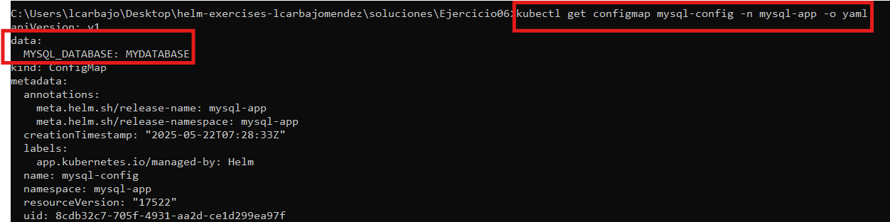

## Solución del Ejercicio 06: Funciones en Helm

---

### **Enunciado**

En este ejercicio, deberás reutilizar el chart de Helm anterior y aplicar funciones.

---

### **Requisitos del despliegue:**

1. Mediante el uso de funciones y sobre los manifiestos del ejercicio anterior, debes realizar lo siguiente:

- Las contraseñas se deben generar de forma randomizada (String de longitud 10, generado aleatoriamente).
- Aplicar `TRIM` a los nombres de usuario y donde creas que es necesario.
- Mediante función, hacer que el nombre de la base de datos se ingrese con mayúsculas.
- Si en el `value.yaml` no se ingresa el tag de Phpmyadmin, hacer que por defecto tome la version `latest`.

---

## Resolución

Siguiendo la estela del ejercicio anterior, debemos modificarlo para que cumpla ciertos requisitos nuevos. En primer lugar, debemos modificar el archivo `secret.yaml` para que:

````yaml
data:
  mysql-root-password: {{ randAlphaNum 10 | b64enc | quote }} 
  mysql-user-password: {{ randAlphaNum 10 | b64enc | quote }}
````
Esto generará una contraseña aleatoria para el usuario root y el usuario mysql. Estas contraseñaes de 10 caracteres serán codificadas en base64 y con `quote` las encerraremos entre comillas. Para mostrarlo en pantalla, decidí mostrar los datos del archivo `secret.yaml` con el comando `kubectl get secret mysql-secret -n mysql-app -o yaml`


El siguiente paso es aplicar el `TRIM` a los nombres de usuario. Para ello, debemos modificar el archivo `mysql-statefulset.yaml` y añadir la siguiente línea:

````yaml
- name: MYSQL_USER
          value: {{ .name | trim | quote }}
````
Esto eliminará los espacios en blanco del nombre del usuario.

Posteriormente, debemos convertir el nombre de la base de datos a mayúsculas. Con esta finalidad, debemos modificar el archivo `configmap.yaml` y añadir la siguiente linea:

````yaml
data:                                 
  MYSQL_DATABASE: {{ .Values.mysql.databaseName | upper | quote }}
````
Esto convertirá el nombre de la base de datos a mayúsculas. Para mostrarlo en pantalla, decidí mostrar los datos del archivo `configmap.yaml` con el comando `kubectl get configmap mysql-config -n mysql-app -o yaml`



Por último, debemos hacer que el tag de phpmyadmin tome la versión `latest` por defecto modificamos el archivo `phpmyadmin-deployment.yaml` y añadimos la siguiente línea:

````yaml
spec:
      containers:
      - name: phpmyadmin
        image: {{ .Values.phpMyAdmin.image }}{{ if .Values.phpMyAdmin.tag }}:{{ .Values.phpMyAdmin.tag }}{{ else }}:latest{{ end }}
````
Esto hará que el tag de phpmyadmin tome la versión `latest` por defecto. Con esta condición, se construye el nombre completo de la imagen del contenedor con su etiqueta (tag) correspondiente. Si no se especifica un tag, se usa la etiqueta latest por defecto. Para mostrarlo en pantalla, usé el comando `kubectl get deployment phpmyadmin -n mysql-app -o yaml` y obtuve lo siguiente:


Una vez cumplido todo los requisitos ejecutamos de manera normal nuestro chart con la creación del tunel correspondiente.

