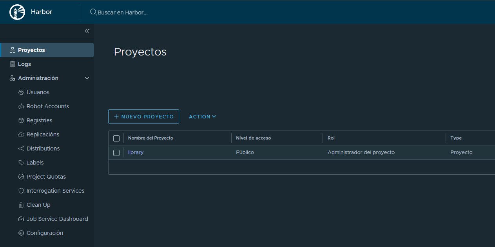
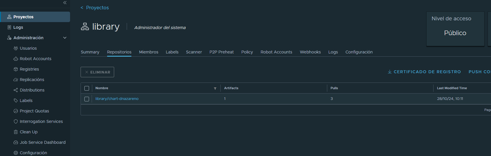

## Solución del Ejercicio 07: Conexión a un Registry Privado y Gestión de Charts en Helm


### **Enunciado**

Debes realizar una conexión y autenticación en un registry privado de Harbor (IP pública), y llevar a cabo operaciones de push, pull e instalación de un chart. Esto te permitirá aprender cómo gestionar charts en un entorno seguro y privado.

---

### **Paso a paso**

#### 1. Descarga del certificado raíz de Harbor

>El certificado raíz es un componente esencial para la autenticación segura en conexiones HTTPS. Al instalarlo en el sistema local, garantizas que el cliente confíe en el certificado del servidor del registry. Sin esta configuración, el sistema considera que el certificado del registry proviene de una autoridad desconocida, lo que da lugar a errores como "certificado firmado por una autoridad desconocida" y evita la conexión segura.
>
>Este proceso de confianza también asegura que la comunicación con el registry sea encriptada y protegida, previniendo la interceptación de datos sensibles como credenciales o configuraciones.

   - Accede al registry privado en el navegador, usando su IP pública.
   - Inicia sesión en Harbor.


   - Ve a la sección de **Proyectos** y selecciona tu proyecto.



   - Descarga el certificado raíz desde la interfaz de Harbor.


#### 2. Activación del certificado raíz en la máquina virtual
   - Copia el certificado descargado (`ca.crt`) a la carpeta `/usr/local/share/ca-certificates/` usando el siguiente comando:
     ```bash
     sudo cp ~/Downloads/ca.crt /usr/local/share/ca-certificates/
     ```
   - Activa el certificado con el siguiente comando:
     ```bash
     sudo update-ca-certificates
     ```

#### 3. Configuración de /etc/hosts para simular un dominio

>El DNS es crucial para mapear la IP del registry a un nombre de dominio, como core.harbor.domain. Muchas aplicaciones, incluyendo helm y docker, requieren un dominio para gestionar certificados correctamente, ya que las conexiones HTTPS suelen fallar si se usan IPs directas debido a políticas de seguridad. Al agregar la IP y el nombre de dominio en /etc/hosts, simulas un DNS local que permite a tu sistema resolver core.harbor.domain correctamente.
>
>Sin esta configuración DNS, el sistema no podría localizar el registry usando el dominio, lo que afectaría comandos como helm push o docker login. Además, facilita la escalabilidad y reutilización de scripts y configuraciones, ya que podrías cambiar la IP del registry en el futuro sin necesidad de modificar múltiples configuraciones

   - Agrega la siguiente línea en el archivo `/etc/hosts`:
     ```plaintext
     <IP_publica>  core.harbor.domain
     ```

#### 4. Empaquetado del chart del ejercicio anterior
   - Ubícate en el mismo directorio donde tienes el chart del ejercicio04 (o posterior) y empaquétalo usando:
     ```bash
     helm package nombre-chart
     ```

#### 5. Inicio de sesión en Harbor desde la consola
   - Inicia sesión en el registry de Harbor con el siguiente comando:
     ```bash
     helm registry login -u <usuario> core.harbor.domain
     ```

#### 6. Subida del chart empaquetado a Harbor
   - Sube el chart al registry:
     ```bash
     helm push nombre-chart-0.1.0.tgz oci://core.harbor.domain/<proyecto>
     ```
   - Entra nuevamente al registry Harbor (ahora puedes hacerlo desde la URL `core.harbor.domain`) y verifica que se ha subido el chart dentro de tu proyecto.

#### 7. Descarga e instalación del chart desde el registry
   - Instala el chart descargado en tu cluster local:
     ```bash
     helm install chartpropio oci://core.harbor.domain/<proyecto>/nombre-chart
     ```

---

## Resolución

1.- Instalación de los recursos en la máquina virtual
- 
Antes de empezar con el ejercicio, comentar que estuve siguiendo también la guia https://medium.com/@Devopscontinens/alongside-harbor-berth-with-minikube-b31e487974f4. Además, tuve que instalar todos los recursos en la máquina virtual para poder cumplimentar el ejercicio.


Una vez ya poseemos los recursos previos pasamos al ejercicio en sí. Comenzamos ejecutando minikube con `minikube start`:


2.- Repositorio de Harbor y configuración de algunos aspectos

Continuamos añadiendo el repositorio de harbor con `helm repo add harbor https://helm.goharbor.io`, clonando este con `git clone https://github.com/goharbor/harbor-helm.git` y la instalación de los recursos con `helm install harbor harbor/harbor -n harbor`:


Mostramos los pods de harbor:


Tras la instalación necesitamos agregar manualmente el host de ingreso y la dirección IP en nuestro /etc/hosts en el host que ejecuta nuestro Minikube y eso se logra con el siguiente comando:

````bash
echo "$(minikube ip) core.harbor.domain" | sudo tee -a /etc/hosts
````

Con esto podremos entrar al sitio web de Harbor a través de la URL https://core.harbor.domain


Ya una vez dentro podemos seguir la guia del propio ejercicio.

3.- Activación del certificado raíz

Ya que hemos instalado los recursos previos, podemos seguir con la guia del ejercicio 7. Ahora iniciamos sesion en Harbor usando nombre de usuario = admin y contraseña = Harbor12345. Una vez dentro descargamos el certificado. 


Luego de la descarga lo copiamos en la carpeta /usr/local/share/ca-certificates/ y activamos el certificado con el siguiente comando:

````bash
sudo cp /home/lcarbajo/Descargas/ca.crt /usr/local/share/ca-certificates/core-harbor-domain.crt
sudo update-ca-certificates
````
4.- Empaquetado del chart del ejercicio anterior

Para empaquetar el chart del ejercicio 4 usamos el siguiente comando desde la carpeta donde se encuentra el chart, donde empaquetamos el chart, nos registramos en Harbor con el admin y subimos el paquete al repositorio de Harbor library:

````bash
# Creamos el paquete del chart
helm package mysql-app-chart
# Nos registramos en Harbor con el admin
helm registry login -u admin core.harbor.domain
# Subimos el paquete al repositorio de Harbor library
helm push mysql-app-chart-0.1.0.tgz oci://core.harbor.domain/library
````


5.- Instalación del chart subido a Harbor en nuestro cluster local

En este punto, ya que hemos subido el chart a Harbor, podemos instalarlo en nuestro cluster local con el siguiente comando:

````bash
helm install lcarbajoharbor oci://core.harbor.domain/library/mysql-app-chart --version 0.1.0
````


Si es verdad que me ocurrió un error al instalar el chart al poseer más cpu y memoria de la que el cluster local posee, pero modifiqué el archivo de valores del chart para que se instale con menos recursos y se instaló correctamente. Realizamos el tunel oportuno y accedemos a phpmyadmin:


